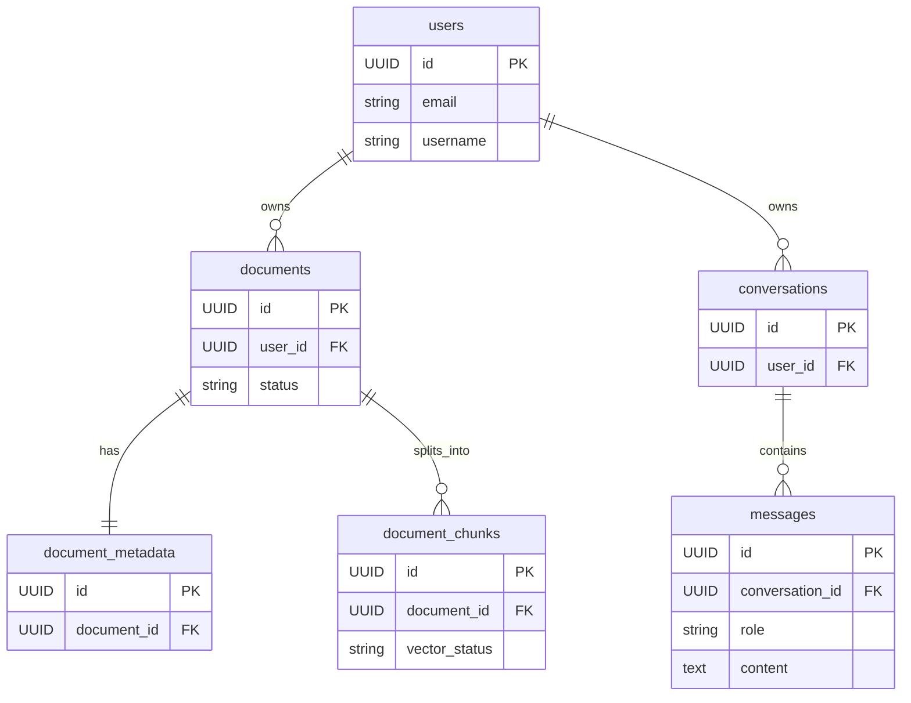

# Database Design

> **Document:** 03_DATABASE_DESIGN.md
> **Version:** 1.0.0
> **Status:** Active — Phase 2 Completed
> **Last Updated:** 2026-07-27
> **Author:** Architecture Team

---

## 1. Database Purpose

The data storage layer of the Hybrid GraphRAG Enterprise Knowledge Assistant manages structured application data. Its primary responsibilities include:
- Storing user accounts and profiles.
- Managing document metadata, storage references, and processing states.
- Persisting chat conversations and messages for the AI assistant interface.
- Storing runtime configurable system parameters.

---

## 2. Database Technology

- **Database Engine:** Supabase PostgreSQL
- **Connection Configuration:** Configured exclusively via `DATABASE_URL` environment variable.
- **ORM:** SQLAlchemy 2.0 (Async)
- **Migration Tool:** Alembic
- **Validation:** Pydantic 2.x

---

## 3. Entity Relationship Description

The relational database follows a clean, normalized structure centered around the `User`.

- A **User** owns multiple **Documents**.
- A **Document** has exactly one **DocumentMetadata** record created after AI pipeline processing.
- A **User** owns multiple **Conversations**.
- A **Conversation** contains multiple ordered **Messages**.

---

## 4. Tables Description

### `users`
Stores application user accounts.
- `id` (UUID, Primary Key)
- `email` (String, Unique, Indexed)
- `username` (String, Unique, Indexed)
- `is_active` (Boolean)
- `created_at` (DateTime)
- `updated_at` (DateTime)

### `documents`
Stores references to uploaded files and tracks their processing lifecycle.
- `id` (UUID, Primary Key)
- `user_id` (UUID, Foreign Key)
- `filename` (String)
- `file_type` (String)
- `storage_path` (Text) — Path in MinIO object storage.
- `status` (Enum: UPLOADED, PROCESSING, COMPLETED, FAILED)
- `created_at` (DateTime)
- `updated_at` (DateTime)

### `document_metadata`
Stores AI-extracted metadata for documents.
- `id` (UUID, Primary Key)
- `document_id` (UUID, Foreign Key, Unique)
- `title` (String, Nullable)
- `language` (String, Nullable)
- `page_count` (Integer, Nullable)
- `chunk_count` (Integer, Nullable)
- `created_at` (DateTime)

### `document_chunks`
Stores text chunks extracted from documents, including tracking fields for future AI pipeline stages.
- `id` (UUID, Primary Key)
- `document_id` (UUID, Foreign Key)
- `chunk_index` (Integer)
- `content` (Text)
- `token_count` (Integer, Nullable)
- `embedding_id` (String, Nullable) — ID in Qdrant.
- `vector_status` (Enum: PENDING, EMBEDDED, INDEXED, FAILED)
- `embedding_model` (String, Nullable)
- `entity_extraction_status` (Enum: PENDING, EXTRACTING, COMPLETED, FAILED)
- `graph_sync_status` (Enum: PENDING, SYNCED, FAILED)
- `created_at` (DateTime)
- `updated_at` (DateTime)

### `conversations`
Stores chat sessions.
- `id` (UUID, Primary Key)
- `user_id` (UUID, Foreign Key)
- `title` (String)
- `created_at` (DateTime)
- `updated_at` (DateTime)

### `messages`
Stores individual chat messages in a conversation.
- `id` (UUID, Primary Key)
- `conversation_id` (UUID, Foreign Key)
- `role` (Enum: USER, ASSISTANT)
- `content` (Text)
- `created_at` (DateTime)

### `system_settings`
Stores dynamic application configuration.
- `id` (UUID, Primary Key)
- `key` (String, Unique, Indexed)
- `value` (Text)
- `created_at` (DateTime)
- `updated_at` (DateTime)

### 4.2 Document Tracking and Storage Strategy

- **Raw Storage:** MinIO Object Storage holds the original uploaded files securely.
- **Relational Metadata:** PostgreSQL stores lightweight tracking metadata (filename, size, type, `storage_path`) to allow rapid querying and association with user IDs. PostgreSQL *never* stores binary document blobs directly.
- **Document Metadata:** An optional one-to-one associated table (`document_metadata`) tracks data extracted by the AI pipeline (e.g., page count, language, chunks).
- **Document Chunks:** A one-to-many associated table (`document_chunks`) stores the text segments of the document.

---

## 5. Indexes and Constraints

| From Entity | To Entity | Relationship Type | Foreign Key | Cascade Behavior |
|---|---|---|---|---|
| User | Document | One-to-Many | `documents.user_id` | Delete Orphan |
| User | Conversation | One-to-Many | `conversations.user_id` | Delete Orphan |
| Document | DocumentMetadata| One-to-One | `document_metadata.document_id` | Delete Orphan |
| Document | DocumentChunk | One-to-Many | `document_chunks.document_id` | Delete Orphan |
| Conversation| Message | One-to-Many | `messages.conversation_id` | Delete Orphan |

---

## 6. Migration Strategy

- **Tool:** Alembic
- **Path:** `backend/app/database/migrations`
- All schema changes must be generated via Alembic auto-generate and manually reviewed.
- Migrations are run synchronously using `psycopg2` driver.
- The application connects asynchronously using `asyncpg` driver.
- **Initial Migration:** `001_initial_database_schema`
- **Deployment:** Managed externally by Supabase. Schema deployed directly to Supabase PostgreSQL using `alembic upgrade head`.

---

## 7. Future Expansion

- **Phase 4:** Add detailed MinIO bucket design for document storage. (Completed)
- **Phase 5:** Add DocumentChunk design for semantic vector chunks. (Completed)
- **Phase 6:** Add Qdrant Collection design for semantic vector chunks.
- **Phase 6:** Add Neo4j Graph Model for extracted entities and relationships.

---

## ER Diagram (Updated Phase 5)

