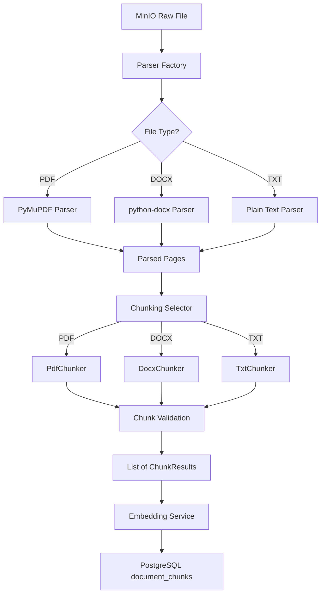

# AI Pipeline Design

> **Document:** 05_AI_PIPELINE.md
> **Version:** 1.0.0
> **Status:** Active — Phase 5 Completed
> **Last Updated:** 2026-07-27
> **Author:** Architecture Team

---

## 1. Purpose

This document describes the AI processing pipeline architecture, including document chunking strategies, embedding generation, entity extraction, and the orchestration of these components during document ingestion.

---

## 2. Current Status

🟢 **Active** — Core pipeline (parsing, chunking, embeddings) completed in Phase 5. Knowledge Graph extraction awaits Phase 6.

---

## 3. Architecture Overview

### 3.1 Pipeline Flow
The AI Pipeline processes uploaded documents through a multi-stage flow:

## Hybrid Chunking Architecture (Phase 5.5)

The pipeline uses a hybrid, strategy-based chunking system that adapts to the document type:

1. **TxtChunker (Fallback)**: Uses LangChain's `RecursiveCharacterTextSplitter` as the standard approach for unstructured text.
2. **PdfChunker**: Preserves physical page boundaries and metadata (`page_number`).
3. **DocxChunker**: Detects structural headings (Heading 1-6) and uses LangChain's `MarkdownHeaderTextSplitter` combined with recursive splitting. It stores the deepest heading as `section_title` and `section_level`.

All chunkers enforce configurable bounds (`MIN_CHUNK_SIZE` and `MAX_CHUNK_SIZE`) through a shared `BaseChunker` validation layer.

## Future Compatibility (Phase 6).

### 3.2 Document Parsing
The system uses a Strategy pattern via `ParserFactory` to handle different file types:
- **PDF**: Uses `PyMuPDF` (`fitz`) for fast, robust text extraction.
- **DOCX**: Uses `python-docx` for native Microsoft Word parsing.
- **TXT**: Native decoding with fallback mechanisms (UTF-8 → latin-1).

### 3.3 Document Chunking
We use **Recursive Character Text Splitting** (via LangChain):
- **Chunk Size**: Configurable via `CHUNK_SIZE` (default: 1000).
- **Chunk Overlap**: Configurable via `CHUNK_OVERLAP` (default: 200).
- **Strategy**: Attempts to split on paragraphs (`\n\n`), then lines (`\n`), then sentences, ensuring natural boundaries are respected.

### 3.4 Embedding Generation
Dense semantic embeddings are generated using the `sentence-transformers` library:
- **Model**: Configurable via `EMBEDDING_MODEL` (e.g., `all-MiniLM-L6-v2` or `BGE-M3`).
- **Processing**: Embeddings are generated in batches for efficiency.
- **Lazy Loading**: The model is loaded into memory only when the first embedding request is made.

### 3.5 Pipeline Orchestration
The `PipelineService` coordinates the flow. It updates the document's state throughout the process (UPLOADED → PROCESSING → COMPLETED) and tracks chunk-level statuses for future phases:
- `vector_status`: Tracks Qdrant embedding state (`EMBEDDED`).
- `entity_extraction_status`: Tracks Neo4j extraction state (`PENDING`).
- `graph_sync_status`: Tracks Neo4j graph sync state (`PENDING`).

---

## 4. Change History

| Date | Version | Change | Author |
|---|---|---|---|
| 2026-07-27 | 0.1.0 | Placeholder document created during Phase 0 Foundation. | Architecture Team |
| 2026-07-27 | 1.0.0 | Updated with Phase 5 parsing, chunking, and embedding architecture. | AI Agent |
