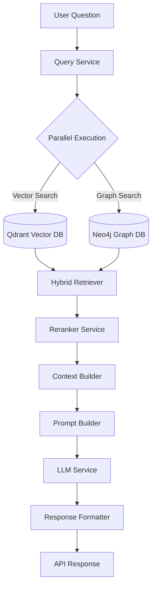
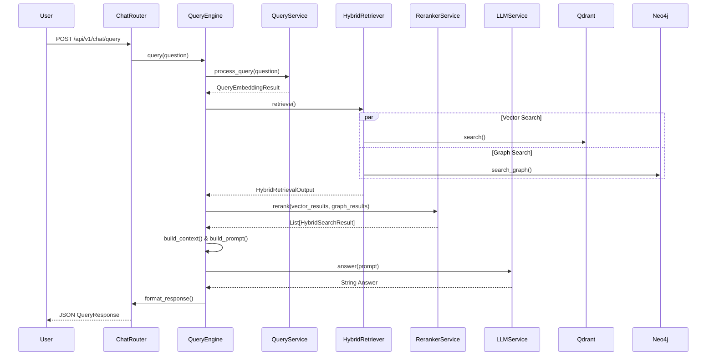

# Hybrid Retrieval Engine Architecture (Phase 8)

This document describes the complete retrieval flow that powers the HybridGraphRAG AI assistant. It orchestrates vector similarity search (Qdrant) with knowledge graph traversals (Neo4j) to ground the final LLM response in factual, structured, and semantic context.

## 1. High-Level Architecture

The Retrieval Engine combines deep semantic search (via dense embeddings) with structural relationship search (via Knowledge Graph).



## 2. Request Flow & Service Responsibilities

### 1. `QueryService`
Normalizes the incoming user query, validates it, and generates a dense vector embedding using `EmbeddingService`. 
- **Output**: `QueryEmbeddingResult`

### 2. `HybridRetriever`
Orchestrates parallel calls to Qdrant and Neo4j using `asyncio.gather`.
- **Vector Flow (`QdrantService.search`)**: Finds semantically similar text chunks using Cosine Distance. Returns matching payload IDs.
- **Graph Flow (`Neo4jService.search_graph`)**: Performs keyword-based node matching and traverses 1-hop relationships. Returns connected document chunks.
- **Enrichment**: Fetches actual chunk contents for Qdrant hits from PostgreSQL.

### 3. `RerankerService`
Merges chunks retrieved from both paths, deduplicating via `chunk_id`.
Calculates a final weighted score based on environment configuration:
```text
FinalScore = (VectorScore * VECTOR_WEIGHT) + (GraphConfidence * GRAPH_WEIGHT)
```
- Defaults: `VECTOR_WEIGHT = 0.7`, `GRAPH_WEIGHT = 0.3`

### 4. `ContextBuilder`
Takes the sorted `HybridSearchResult` objects and builds the textual context block for the LLM. 
- Groups chunks by source `document_id`.
- Sorts chunks internally by `chunk_index` to maintain reading flow.
- Truncates context aggressively if it approaches `MAX_CONTEXT_TOKENS` limits.

### 5. `PromptBuilder`
Combines the User Question, Context String, and Graph Facts (Relationships & Entities) into a structured system prompt.
Enforces strict anti-hallucination instructions.

### 6. `LLMService`
A provider-agnostic interface that dispatches the prompt to OpenAI, Gemini, Ollama, or Azure based on the `LLM_PROVIDER` environment variable.

### 7. `ResponseFormatter`
Assembles the LLM output text alongside structured metadata (extracted citations, retrieved raw chunks, matching graph entities, and overall confidence score) into a unified `QueryResponse` JSON object.

## 3. Sequence Diagram


