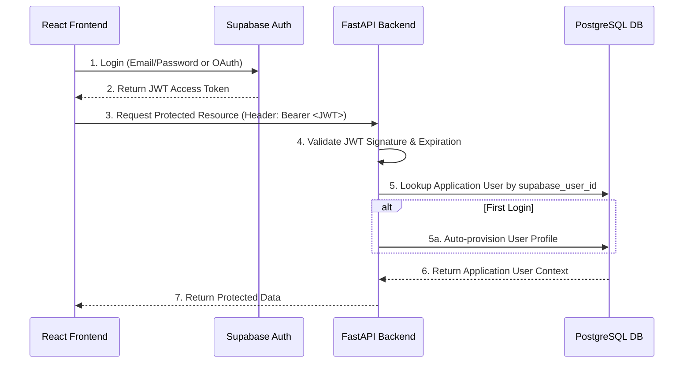

# Security Design

> **Document:** 07_SECURITY_DESIGN.md
> **Version:** 1.0.0
> **Status:** Active — Phase 3 Completed
> **Last Updated:** 2026-07-27
> **Author:** Architecture Team

---

## 1. Authentication Overview

The Hybrid GraphRAG Enterprise Knowledge Assistant delegates all authentication and identity management to **Supabase Auth**. This approach ensures industry-standard security practices, eliminates the need to store passwords in the application database, and provides robust JWT (JSON Web Token) generation.

The FastAPI backend acts as a resource server. It does not issue tokens; instead, it validates the JWTs issued by Supabase before granting access to protected API endpoints.

---

## 2. Architecture Flow



---

## 3. JWT Validation Flow

Every protected route in the API utilizes the `get_current_user` FastAPI dependency. 

1. **Extraction:** The dependency extracts the Bearer token from the `Authorization` header using FastAPI's `HTTPBearer`.
2. **Validation:** The `decode_access_token` function (using PyJWT) verifies the signature against the `SUPABASE_JWT_SECRET` and checks the expiration (`exp`) claim.
3. **Rejection:** If the token is missing, expired, or malformed, the API immediately returns an HTTP `401 Unauthorized` response.

---

## 4. User Identity Management

User identities are synchronized between Supabase and the application database.

- **Supabase Auth (`auth.users`):** Stores the source of truth for identity, including email, encrypted passwords, and OAuth links.
- **Application DB (`public.users`):** Stores the application-specific profile (e.g., `username`, `is_active`, `role`) and links to Supabase via the `supabase_user_id` column.

**Auto-Provisioning:** When a user successfully authenticates via Supabase for the first time and accesses a protected endpoint, the `UserService.provision_user` method automatically creates an application profile for them, defaulting their username to their email prefix.

---

## 5. Authorization and Roles

The application supports Role-Based Access Control (RBAC). The `users` table includes a `role` column (default: `USER`).

The `require_role(*allowed_roles)` dependency factory allows granular endpoint protection:

```python
@router.get("/admin/settings")
async def admin_settings(
    current_user: AuthenticatedUser = Depends(require_role("ADMIN")),
):
    ...
```

If a user lacks the required role, the API returns an HTTP `403 Forbidden` response.

---

## 6. Security Considerations

- **No Passwords Stored:** The application PostgreSQL database never stores user passwords or password hashes.
- **Secret Management:** The JWT secret (`SUPABASE_JWT_SECRET`), Service Key, and Database URLs are loaded strictly from environment variables. They must never be hard-coded or committed to version control.
- **Log Sanitization:** Authentication exceptions are handled centrally. Tokens and sensitive headers are never printed to application logs.

---

## 7. Environment Variables

The following environment variables are required for the security layer:

- `SUPABASE_URL`: The URL of the Supabase project.
- `SUPABASE_ANON_KEY`: The public anonymous key for frontend clients (if applicable).
- `SUPABASE_SERVICE_KEY`: The admin service role key for backend operations.
- `SUPABASE_JWT_SECRET`: The secret key used to verify Supabase JWT signatures.
