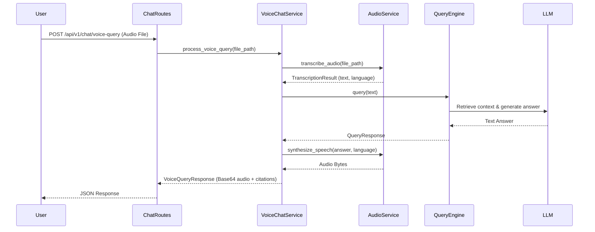

# Voice-to-Voice RAG Pipeline

This document details the architectural components and flow of the Voice-to-Voice capabilities within the Hybrid GraphRAG system.

## Architecture

The Voice Pipeline is orchestrated by the `VoiceChatService` and leverages the existing `QueryEngine` for all hybrid retrieval operations.

## Request Flow
1. **Audio Upload**: An `.m4a`, `.mp3`, or `.wav` file is submitted to the endpoint. The endpoint temporarily saves the file.
2. **Transcription (STT)**: The `AudioService` uses the `STT_MODEL` (e.g., `whisper-large-v3`) via Groq to transcribe the audio into text and automatically identify the spoken language (`en` or `ar`).
3. **GraphRAG Execution**: The transcribed text is submitted to the existing `QueryEngine`.
4. **Bilingual Answer Generation**: The `PromptBuilder` includes an explicit instruction ensuring the LLM replies in the same language as the user's question, without relying on middleware translation.
5. **Synthesis (TTS)**: The LLM's text response is converted back into speech using the appropriate `canopylabs` model mapped to the detected language.
6. **Response Assembly**: The generated audio is Base64 encoded and returned to the client alongside standard RAG citations, sources, and a list of `models_used` for traceability.

## Error Handling
- **Temporary Files**: `chat_routes.py` uses a `try/finally` block to guarantee that uploaded temporary audio files are removed from the server regardless of execution success or failure.
- **Service Failures**: Native HTTP 500 exceptions are raised if STT, TTS, or the Query Engine fails, cascading gracefully to the client.

## Voice Models
The system explicitly avoids hardcoded models. Current configurations (read from `.env`):
- **STT**: `whisper-large-v3`
- **TTS (English)**: `canopylabs/orpheus-v1-english`
- **TTS (Arabic)**: `canopylabs/orpheus-arabic-saudi`
