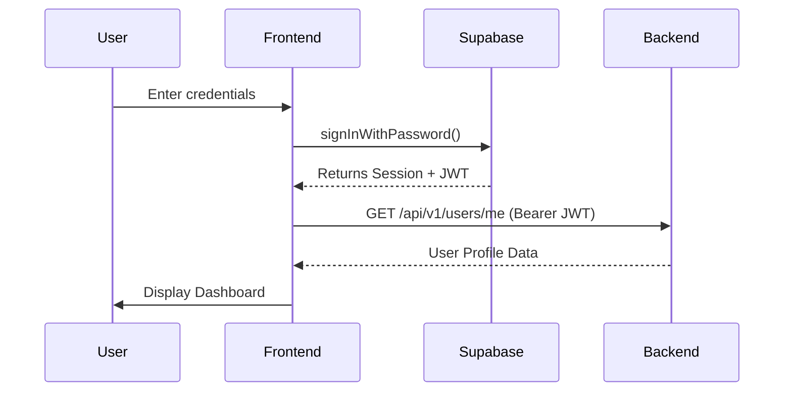
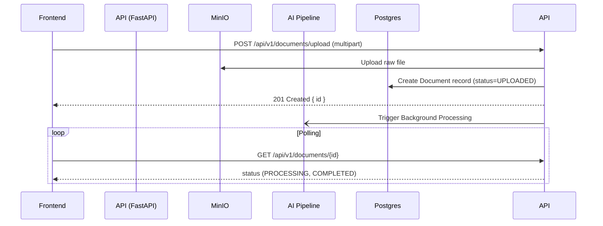
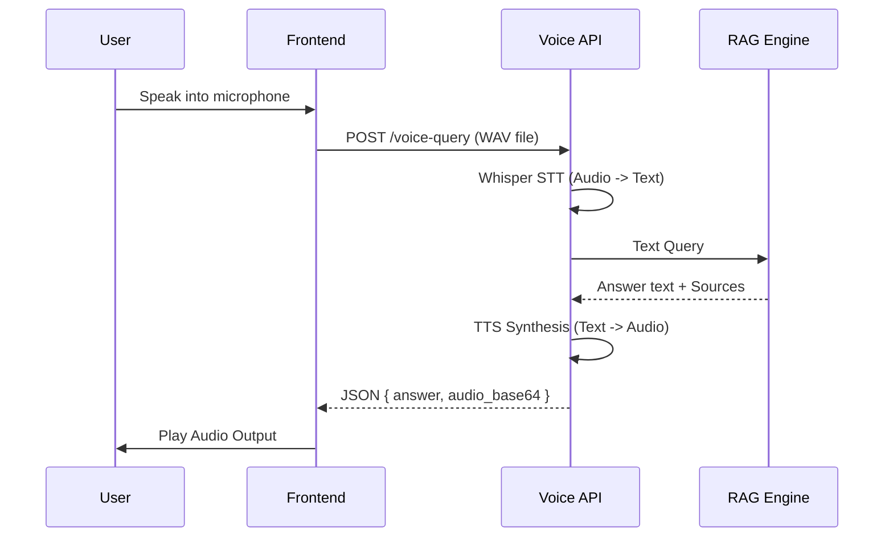

# Frontend Implementation Guide

> **Document:** FRONTEND_IMPLEMENTATION_GUIDE.md
> **Version:** 1.0.0
> **Target Audience:** React Frontend Developers
> **Last Updated:** 2026-07-28

This document serves as the comprehensive implementation guide for the React frontend, mapping out every screen, state management recommendation, and API integration required to consume the completed Hybrid GraphRAG backend.

---

## 1. State Management Architecture

We recommend the following state management stack to ensure robust caching, optimistic updates, and clean separation of concerns:

- **Server State (API Layer):** `React Query` (TanStack Query v5)
  - Ideal for caching `/documents` lists, managing loading/error states for queries, and implementing optimistic updates (e.g., when a document is uploaded, eagerly appending it to the library list).
- **Local Client State (UI Layer):** `Zustand`
  - For global UI states such as sidebar toggles, theme preferences (dark/light mode), and the active conversation context.
- **Form State:** `React Hook Form` + `Zod`
  - For validation of uploads, chat inputs, and settings schemas.
- **Audio State:** Custom React Hooks
  - For managing MediaRecorder API (STT input) and HTMLAudioElement (TTS playback).

---

## 2. Screens and Page Mapping

### 2.1 Login / Register
**Purpose:** Authenticate the user into the platform.
- **API Endpoint:** Managed via Supabase JS Client (`supabase.auth.signInWithPassword`, `supabase.auth.signUp`).
- **Authentication:** None (Public).
- **Request Schema:** `{ email, password }`
- **Response Schema:** Supabase Session Object + JWT.
- **State:**
  - **Loading:** Spinner on submit button.
  - **Success:** Redirect to Dashboard.
  - **Error:** Toast message "Invalid credentials".
- **Validation Rules:** Valid email format, password > 8 chars.
- **Next Screen:** Dashboard.

### 2.2 Dashboard
**Purpose:** Overview of recent activity, document counts, and quick actions.
- **API Endpoint:** `GET /api/v1/users/me`
- **Authentication:** Bearer Token.
- **Response Schema:** `{ id, email, username, role, is_active }`
- **State:**
  - **Loading:** Skeleton loaders for user profile widget.
  - **Empty:** N/A.

### 2.3 Document Library
**Purpose:** View all uploaded documents and their processing status.
- **API Endpoint:** `GET /api/v1/documents`
- **Authentication:** Bearer Token.
- **Response Schema:** `Array<{ id, filename, status, file_size, created_at }>`
- **State:**
  - **Loading:** Table skeleton rows.
  - **Empty:** "No documents uploaded yet" graphic + "Upload" button.
  - **Error:** Retry button ("Failed to load documents").
  - **Success:** Data table with sortable columns.
- **Buttons:**
  - **"Delete" (Visible when document selected):**
    - **Endpoint:** `DELETE /api/v1/documents/{document_id}`
    - **Payload:** None
    - **Optimistic Update:** Remove row from React Query cache immediately.

### 2.4 Upload Document
**Purpose:** Interface for uploading PDF/TXT/DOCX files.
- **API Endpoint:** `POST /api/v1/documents/upload`
- **Authentication:** Bearer Token.
- **Request Schema:** `multipart/form-data` with `file`.
- **Response Schema:** `{ id, filename, status, message }`
- **State:**
  - **Loading:** Progress bar reflecting upload progress (via Axios/fetch).
  - **Success:** "Document uploaded successfully" toast, redirect to Processing Status or Library.
  - **Error:** "File too large" or "Unsupported format" toast.
- **Validation:** File size < 50MB, allowed types `.pdf, .docx, .txt`.

### 2.5 Processing Status (Details)
**Purpose:** Track the chunking, embedding, and Neo4j extraction status of a document.
- **API Endpoint:** `GET /api/v1/documents/{document_id}`
- **Authentication:** Bearer Token.
- **Response Schema:** `{ id, status, vector_status, entity_extraction_status, chunk_count }`
- **State:**
  - **Loading:** Spinner.
  - **Success:** Render stepper (Uploaded -> Parsed -> Chunked -> Embedded -> Graph Extracted).
  - **Retry:** Polling (e.g., every 3s via React Query `refetchInterval`) until `status === 'COMPLETED'`.

### 2.6 Text Chat
**Purpose:** Core Hybrid GraphRAG conversational interface.
- **API Endpoint:** `POST /api/v1/chat/query`
- **Authentication:** Bearer Token.
- **Request Schema:** `{ query, conversation_id }`
- **Response Schema:** `{ answer, sources, entities }`
- **State:**
  - **Loading:** Typing indicator bubble.
  - **Success:** Appends assistant message to chat history.
  - **Error:** "Failed to generate response. Try again."
- **Forms:**
  - **Chat Input:** Validation: `query` cannot be empty string.

### 2.7 Voice Chat
**Purpose:** Voice-to-Voice conversational interface using Whisper and Orpheus.
- **API Endpoint:** `POST /api/v1/chat/voice-query`
- **Authentication:** Bearer Token.
- **Request Schema:** `multipart/form-data` with `audio_file`.
- **Response Schema:** `{ transcription, detected_language, answer, audio_base64, sources }`
- **State:**
  - **Listening:** Audio waveform animation.
  - **Loading:** "Processing..." spinner.
  - **Success:** Autoplay Base64 audio returned by API.
- **Buttons:**
  - **"Hold to Speak" / "Tap to Speak":** Triggers MediaRecorder API.

---

## 3. Sequence Diagrams (Mermaid)

### 3.1 Authentication Flow

### 3.2 AI Pipeline (Upload & Process)

### 3.3 Voice Chat Flow

---

## 4. Backend to Frontend Mapping

| Backend Endpoint | Frontend Screen | React Component | API Hook | UI Element |
|---|---|---|---|---|
| `GET /api/v1/users/me` | Dashboard / Sidebar | `UserProfile` | `useUserMe()` | Sidebar Avatar, Name |
| `POST /api/v1/documents/upload` | Upload Document | `UploadDropzone` | `useUploadDocument()` | Drag & Drop Zone, Progress Bar |
| `GET /api/v1/documents` | Document Library | `DocumentTable` | `useDocuments()` | DataGrid, Pagination |
| `GET /api/v1/documents/{id}` | Processing Status | `DocumentStatusStepper` | `useDocumentDetails()` | Status Stepper, Badge |
| `DELETE /api/v1/documents/{id}` | Document Library | `DocumentTableRow` | `useDeleteDocument()` | "Trash" IconButton |
| `POST /api/v1/chat/query` | Text Chat | `ChatInterface` | `useSendQuery()` | Chat Input, Send Button |
| `POST /api/v1/chat/voice-query` | Voice Chat | `VoiceAssistant` | `useSendVoiceQuery()` | Microphone Button, Waveform |
| `POST /api/v1/audio/transcribe` | Debug / Tools | `TranscribeTool` | `useTranscribe()` | Upload Audio button |
| `POST /api/v1/audio/synthesize` | Debug / Tools | `SynthesizeTool` | `useSynthesize()` | Textarea, Play button |

---

## 5. Implementation Recommendations

1. **Audio Handling:** Use modern `MediaRecorder` APIs. Convert audio strictly to `WAV` or `WebM` before transmitting to `/api/v1/chat/voice-query`.
2. **Base64 Playback:** The Voice API returns `audio_base64`. In React, set the source as `<audio src="data:audio/mp3;base64,...">`.
3. **CORS:** Ensure the React development server's domain (e.g., `http://localhost:5173`) is added to the `ALLOWED_ORIGINS` environment variable in the backend.
4. **JWT Interceptor:** Configure Axios to automatically attach the `Authorization: Bearer <token>` header to all requests intercepting it directly from the Supabase session context.
