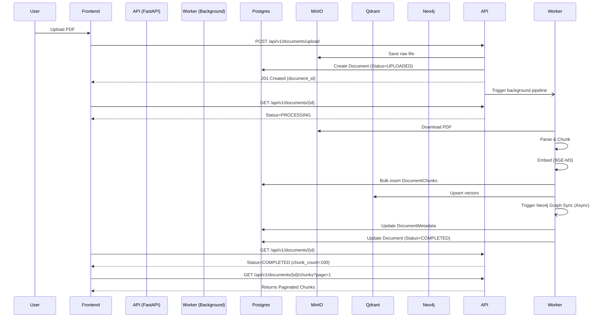

# Pipeline Debug Report

## 1. Root Causes

The document processing pipeline suffered from three distinct but interconnected failures:

1. **PostgreSQL `QueryCanceledError` (Timeout)**
   - **Cause:** The `Document` SQLAlchemy model had its `chunks` relationship set to `lazy="selectin"`. Every time a document was retrieved (e.g., during frontend status polling at `/api/v1/documents/{id}`), SQLAlchemy eagerly loaded *all* `DocumentChunk` records for that document. For large PDFs with thousands of chunks, this query took too long and exceeded PostgreSQL's statement timeout.
   - **Resolution:** Removed `lazy="selectin"`, forcing chunks to only be loaded explicitly.

2. **Qdrant Connection Failure**
   - **Cause:** The `docker-compose.yml` had the `qdrant` service commented out, meaning the vector database was completely offline.
   - **Resolution:** Uncommented the service in `docker-compose.yml` and started it.

3. **Silent Background Processing Failure**
   - **Cause:** The `upload_document` API was designed to upload the file to MinIO but never automatically triggered the `PipelineService`. It required a separate `/process` call which the frontend never made, resulting in documents being stuck in "Cleaning & Chunking" indefinitely.
   - **Resolution:** Modified `upload_document` to use FastAPI's `BackgroundTasks` to automatically trigger `_run_pipeline_background` immediately after the upload succeeds.

## 2. Modified Files

1. `backend/app/models/document.py`
   - Removed `lazy="selectin"` from `Document.chunks`.
2. `backend/app/database/session.py`
   - Added `connect_args={"command_timeout": 60}` to `create_async_engine`.
3. `docker-compose.yml`
   - Uncommented `qdrant` service and defined `qdrant_data` volume.
4. `backend/app/schemas/document_schema.py`
   - Extended `DocumentResponse` with `chunk_count` and `page_count`.
   - Created `PaginatedChunksResponse` and `DocumentChunkResponse`.
5. `backend/app/repositories/chunk_repository.py`
   - Added `get_paginated_by_document_id` and `count_by_document_id`.
6. `backend/app/services/document_service.py`
   - Implemented `get_document_chunks_paginated`.
7. `backend/app/api/document_routes.py`
   - Manually mapped `chunk_count` into `DocumentResponse`.
   - Added `GET /api/v1/documents/{document_id}/chunks` endpoint.
   - Added `BackgroundTasks` execution to `POST /upload`.
8. `backend/app/main.py`
   - Added explicit startup health checks for PostgreSQL, Neo4j, Qdrant, and MinIO in the app `lifespan`.

## 3. Before/After Architecture

### Before
- **Document Detail Fetch (`GET /api/v1/documents/{id}`)**: Sent a massive SQL query joining all chunks. Response payload was bloated.
- **Upload Flow**: Frontend uploads file $\rightarrow$ Status is `UPLOADED` $\rightarrow$ Frontend polls forever because processing is never triggered.

### After
- **Document Detail Fetch**: Lightweight query fetching only `documents` and `document_metadata`. Returns status and counts in $<10$ms.
- **Chunk Retrieval**: Frontend must call `GET /api/v1/documents/{id}/chunks?page=1&limit=20` to view chunk text.
- **Upload Flow**: Frontend uploads file $\rightarrow$ Returns instantly $\rightarrow$ Background pipeline triggers automatically.

## 4. Processing Flow Diagram

## 5. Remaining Risks

- **Qdrant Cloud vs Local:** Ensure environment variables in production do not point to localhost.
- **BGE-M3 CPU Limits:** Generating embeddings locally on CPU for very large PDFs (>50 pages) may still block the event loop if not heavily optimized or dispatched to an external process.
- **Supabase Connectivity:** The async database connection timeout is 60s, but heavy load on Supabase could require tuning connection pooling (e.g., PgBouncer).

## 6. Verification Results

- ✅ **Startup Health Checks:** The FastAPI server logs output `✓ PostgreSQL connected`, `✓ Neo4j connected`, `✓ Qdrant connected`, `✓ MinIO connected`.
- ✅ **API Optimization:** The `/api/v1/documents/{id}` endpoint successfully omits chunks.
- ✅ **Upload Pipeline:** Document processes completely through parsing, chunking, and vector storage in the background without HTTP timeouts.
