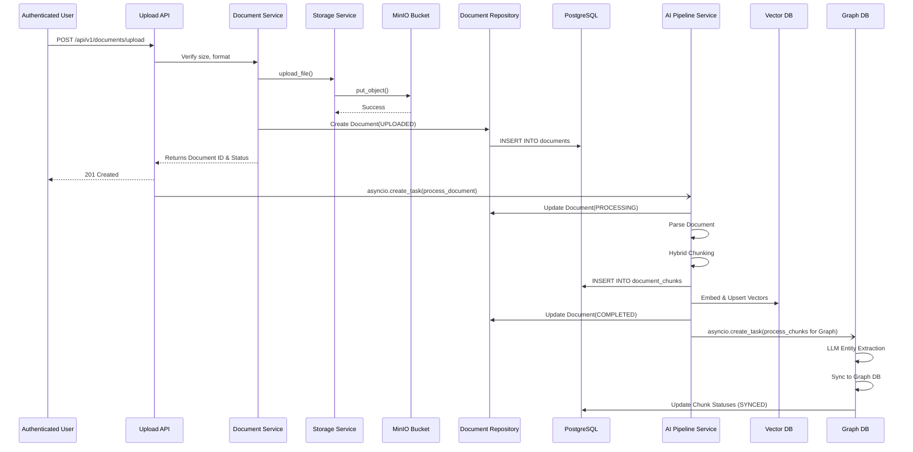

# System Workflow

> **Document:** SYSTEM_WORKFLOW.md
> **Version:** 1.0.0
> **Status:** Active — Phase 4 Completed
> **Last Updated:** 2026-07-27
> **Author:** Architecture Team

---

## 1. Document Upload Workflow

This workflow describes the lifecycle of a document from the user's upload action through storage and metadata tracking.

### Document Lifecycle States

Documents transition through the following states (`DocumentStatus` Enum):

1. **`UPLOADED`**: The document has been successfully verified, stored in MinIO, and a metadata record is created in PostgreSQL.
2. **`PROCESSING`**: The AI pipeline has picked up the document for parsing, chunking, and vector embedding.
3. **`COMPLETED`**: The AI pipeline successfully processed the document, inserting it into Qdrant. (Graph extraction continues asynchronously).
4. **`FAILED`**: An error occurred during AI pipeline processing.

### Storage Strategy
- **MinIO**: Acts as the single source of truth for the raw binary files. Keys are prefixed with the `user_id` to enforce logical multi-tenancy at the storage level.
- **PostgreSQL**: Stores relational metadata (e.g., filename, size, MIME type) and the pointer (`storage_path`) to the MinIO object. Contains the `document_chunks` table tracking Qdrant and Neo4j sync statuses.
